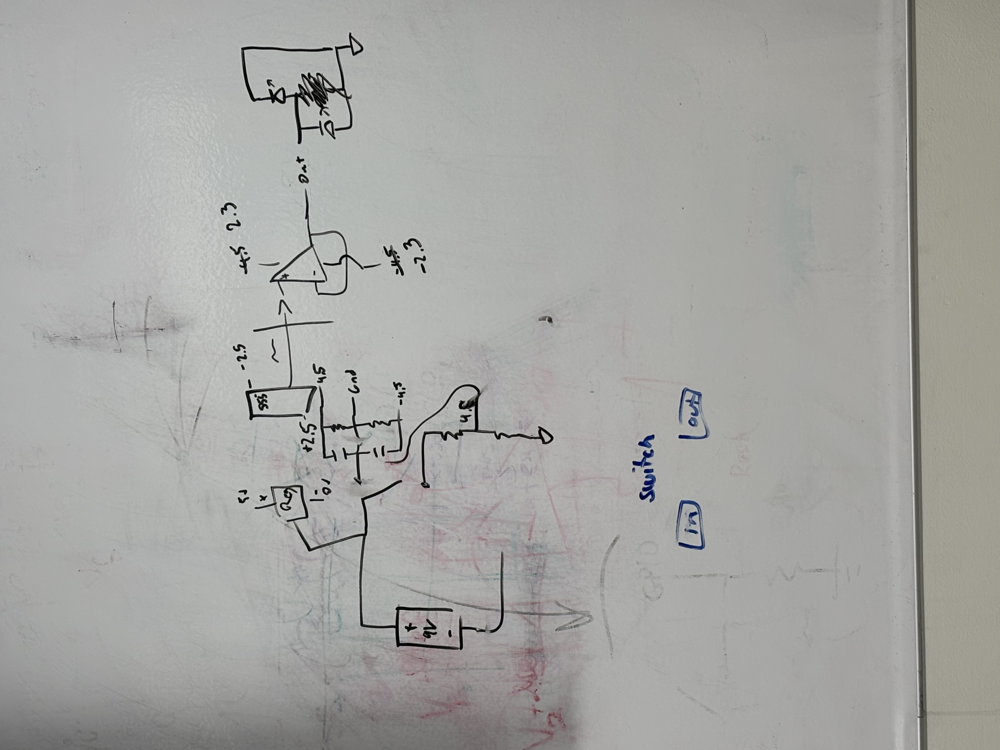
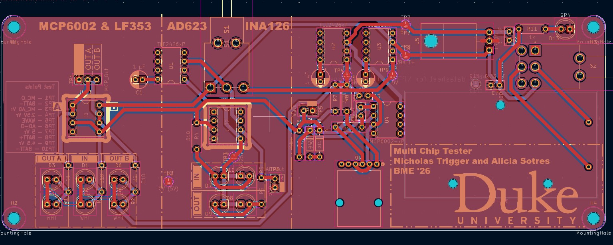
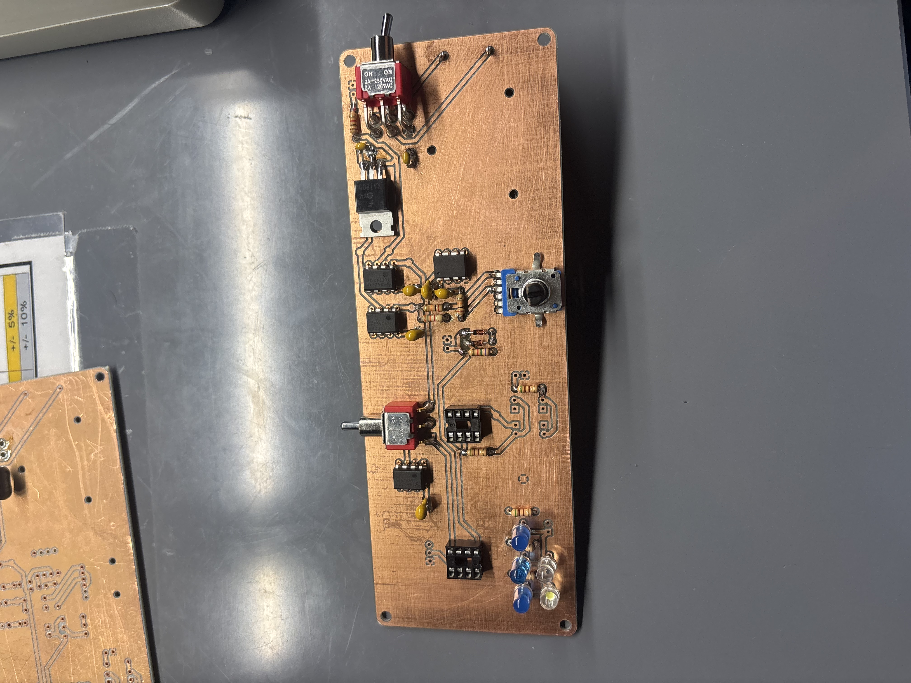

## Circuit Design 
May 19th 2025

* Created beginning of circuit design for for ADC623 INA126 testing circuit 

* Started with Kicad circuit creation

May 20th 2025

* Built and Tested Voltage Regulator Circuit (working)
* Built and Tested Sine Wave Generator Circuit (working)
    * Decided against using 555 timer for sine wave oscillating signal 
    * Both circuits were built on an open breadboard to start with to allow us to troubleshoot easily 
    * Decided on Potentionmeter Min Resistance as 10kOhm 
 

May 28th 2025

* Ordered components from DigiKey ([List](https://www.digikey.com/en/mylists/list/94XYNUR698))

May 29th 2025 

* Started PCB layout, found footprints for non-standard parts.

June 2nd-3rd 2025

* Reannotated schematic and pcb.
* Finished pcb layout.

June 4th 2025 

* Duplicated board file to modify for milling machine specification.

June 10th 2025 

* Edited PCB schematic for remilling. Fixed clearance issues with tracks. 
* Changed through-hole diameters to allow for rivets to be placed in difficult to solder locations (chip and pin sockets)

June 25th 2025

* Received milled board, tested board for issues before soldering. 
* Soldered main components, need more blue and white LEDS

